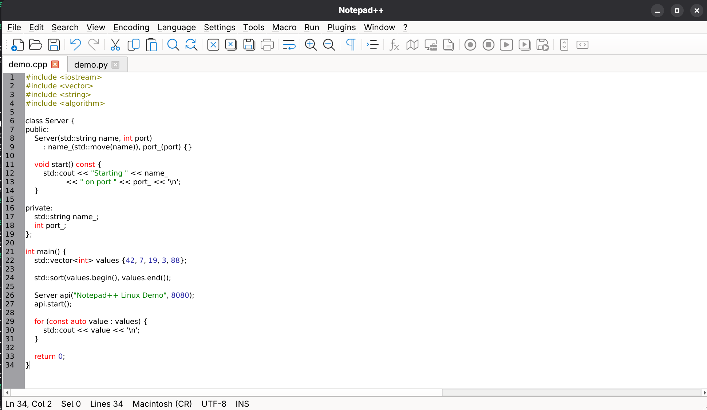

# TextPinnacle

**TextPinnacle** is an independent native Linux text and source-code editor created and maintained by **Emanuel Damasceno**. It is derived from the open-source **Notepad++** codebase and uses **Qt 6**, **Scintilla**, and **Lexilla**.

**No Wine required.**

> **Independent project:** TextPinnacle is not an official Notepad++ release and is not affiliated with or endorsed by the Notepad++ project.

[Download the alpha](https://github.com/aedamasceno/textpinnacle/releases) · [Report a Linux bug](https://github.com/aedamasceno/textpinnacle/issues/new/choose) · [Help with the Linux port](CONTRIBUTING-LINUX.md)

The published alpha includes an RPM built and tested on **Fedora 44 x86_64**. Read its release notes for installation instructions and limitations. Published packages may lag behind the development branch.

> **Status: Alpha / Work in Progress**
>
> The application runs natively on Linux and core editing functionality is operational. Full Notepad++ feature parity is still in progress.

TextPinnacle builds on the open-source Notepad++ codebase while maintaining its own Linux-specific development, branding, releases, and project direction. Notepad++ and its original source code remain the work of the Notepad++ project and its contributors.

## Screenshot



## Why This Project Exists

I am a longtime Notepad++ user who moved to Linux full time. I wanted the familiar Notepad++ workflow without running the Windows application through Wine, so I started porting the existing project to a native Linux application.

TextPinnacle's goal is to bring the editing workflow and capabilities I value from Notepad++ to a native Linux application while keeping the project maintainable against upstream development.

## Latest Development — September 17, 2026

New work is available on the
[linux-port-recovery branch](https://github.com/aedamasceno/textpinnacle/tree/linux-port-recovery):

- Live Function List, File Browser, Document List, and Document Map panels.
- Session and crash recovery for unsaved and modified documents.
- Safer saving, recovery checkpoints, and shutdown failure handling.
- Automated regression tests for panel behavior and document persistence.

These changes are pending final review and integration into the main
development branch. They are not included in the published alpha download.

Printing, macro recording/playback, dual views, and synchronized scrolling
remain unfinished.

## Project Status

| Feature | Status |
|---|---|
| Native Linux executable | ✅ Working |
| Qt 6 user interface | ✅ Working |
| Scintilla editor | ✅ Working |
| Multiple document tabs | ✅ Working |
| New / Open / Save / Save As / Save All | ✅ Working |
| Undo / Redo | ✅ Working |
| Cut / Copy / Paste | ✅ Working |
| Line numbers | ✅ Working |
| Word Wrap | ✅ Working |
| Zoom In / Zoom Out | ✅ Working |
| Show All Characters | ✅ Working |
| Indent Guides | ✅ Working |
| Notepad++ toolbar icons | ✅ Working |
| Find / Replace | 🟡 Working, still being expanded |
| Unsaved document/session recovery | 🟡 Implemented, still being validated |
| Lexilla syntax highlighting | 🟡 Basic integration working; language coverage in progress |
| Function List | 🟡 In progress |
| File Browser | 🟡 In progress |
| Document List | 🟡 In progress |
| Printing | 🟡 In progress |
| Document Map | 🔴 Not complete |
| Macro recording/playback | 🔴 Not complete |
| Synchronized scrolling | 🔴 Not complete |
| Plugin compatibility | 🔴 Not available |

The table above reflects the current development state and will change frequently as the Linux port progresses.

## Building on Linux

The current development environment uses Qt 6, CMake, Ninja, and a C++17 compiler.

From the repository root:

```bash
cmake -S . -B build-linux -G Ninja -DCMAKE_BUILD_TYPE=Debug
cmake --build build-linux -j$(nproc)
```

Run the application with:

```bash
./build-linux/npp_linux
```

## Development Approach

The Linux port currently uses:

- **Qt 6** for the native Linux user interface
- **Scintilla** for the editor component
- **Lexilla** for lexer/syntax-highlighting support
- **CMake** for the Linux build

Linux-specific implementation is kept under `linux/` where practical so that future synchronization with upstream Notepad++ remains manageable.

## Current Development Priorities

Work is currently focused on:

- completing dockable panels such as Function List, File Browser, Document List, and Document Map
- expanding search and replace functionality
- completing printing support
- macro recording and playback
- language/lexer integration
- encoding and EOL handling
- session persistence and recovery
- tab/document workflow
- Linux packaging and desktop integration
- keeping the port synchronized with upstream Notepad++ changes

## Contributing

Contributions, testing, bug reports, and technical discussion are welcome.

Areas where help would be particularly useful:

- Qt 6 / C++ development
- Scintilla and Lexilla integration
- Notepad++ feature parity
- Linux packaging
- Fedora, Debian, Ubuntu, and other distribution testing
- C++ code review
- documentation

If you would like to help, see the [Linux contribution guide](CONTRIBUTING-LINUX.md), open an issue in this repository, or submit a pull request targeting `linux-port`.

## More Information

See [LINUX-PORT.md](LINUX-PORT.md) for additional project background, architecture notes, roadmap information, and contribution details.

## Credits

Notepad++ and its original source code are the work of the Notepad++ project and its contributors.

This repository is an independent effort to port that existing work to native Linux. Credit for Notepad++ itself belongs to its original creators and contributors.

## License

This project remains subject to the licensing terms of the upstream Notepad++ source code and the third-party components included in the repository.
